<div align="center">

# 🎣 Forum Wędkarskie — Fishing Forum

**A production-grade fishing community forum built as a modular monolith with Clean Architecture.**

FastAPI backend · React SPA · PostgreSQL · deployed on Kubernetes with full observability.

<br/>

<!-- ───────────── CI / CD · live GitHub Actions status ───────────── -->
[](https://github.com/JakubPatkowski/Python-Forum-API/actions/workflows/ci-backend.yml)
[](https://github.com/JakubPatkowski/Python-Forum-API/actions/workflows/ci-frontend.yml)
[](https://github.com/JakubPatkowski/Python-Forum-API/actions/workflows/e2e-kind.yml)
[](https://github.com/JakubPatkowski/Python-Forum-API/actions/workflows/docker-build.yml)
<br/>
[](https://github.com/JakubPatkowski/Python-Forum-API/actions/workflows/codeql.yml)
[](https://github.com/JakubPatkowski/Python-Forum-API/actions/workflows/security.yml)
[](https://github.com/JakubPatkowski/Python-Forum-API/actions/workflows/performance.yml)
[](https://github.com/JakubPatkowski/Python-Forum-API/actions/workflows/api-docs.yml)
[](https://codecov.io/gh/JakubPatkowski/Python-Forum-API)

<br/>

<!-- ───────────── Backend stack ───────────── -->


<!-- ───────────── Frontend & infrastructure ───────────── -->


<!-- ───────────── Quality & meta ───────────── -->


<!-- ───────────── Live docs ───────────── -->
[](https://jakubpatkowski.github.io/Python-Forum-API/)

</div>

---

## 📑 Table of Contents

- [About the Project](#-about-the-project)
- [Who It's For](#-who-its-for)
- [Screenshots](#-screenshots)
- [Features](#-features)
- [Architecture](#-architecture)
  - [Clean Architecture](#clean-architecture)
  - [Modular Monolith](#modular-monolith)
  - [Request Lifecycle](#request-lifecycle)
- [Tech Stack](#-tech-stack)
- [Database Schema](#-database-schema)
- [Getting Started](#-getting-started)
  - [Prerequisites](#prerequisites)
  - [Option A — Docker Compose (recommended)](#option-a--docker-compose-recommended)
  - [Option B — Local development](#option-b--local-development-without-docker)
  - [Option C — Kubernetes (minikube)](#option-c--kubernetes-minikube)
- [Configuration](#-configuration)
- [API Overview](#-api-overview)
- [Security](#-security)
- [Testing](#-testing)
  - [Unit & integration tests](#unit--integration-tests)
  - [Coverage (Codecov)](#coverage-codecov)
  - [Load testing (k6)](#load-testing-k6)
- [Monitoring & Observability](#-monitoring--observability)
- [CI/CD Pipeline](#-cicd-pipeline)
- [Project Structure](#-project-structure)
- [Useful Commands](#-useful-commands)
- [Roadmap](#-roadmap)
- [Documentation](#-documentation)
- [Contributing](#-contributing)
- [License](#-license)

---

## 🌊 About the Project

**Forum Wędkarskie** is a full-featured discussion forum for a fishing community, built as
an academic project for the *Advanced Programming in Python* course. Its goal goes beyond
"a working website" — it demonstrates modern, production-oriented software engineering
practices end to end:

- **Clean Architecture** with a strict dependency rule and strong typing (`mypy --strict`).
- **Modular monolith** — one deployable process, internally split into independent domain modules communicating via domain events.
- A complete delivery chain: **multi-stage Docker** images, **Alembic** migrations, **Kubernetes** deployment on minikube.
- First-class **security**, **testing** (unit, integration, load) and **observability** (Prometheus, Grafana, Loki).

The application is split into two independently deployable components: a **FastAPI** backend
and a **React** Single Page Application. The whole stack can be brought up locally with a
single `docker compose up`, or deployed to a Kubernetes cluster.

### What problems it solves

| Problem | Solution in the app |
|---------|---------------------|
| Knowledge scattered across social media | Content organized into **categories** and **threads**, with **full-text search**. |
| Flat, hard-to-follow discussions | **Nested comments** (a reply tree) via a materialized-path model. |
| Sharing media | Attach **images, video, audio and documents** to posts and comments (stored in MinIO). |
| Recognition & engagement | **Likes** and per-user **statistics** (posts, comments, likes received). |

---

## 👥 Who It's For

| Audience | Needs met by the app |
|----------|----------------------|
| **Hobby anglers** | Read & publish tips, ask questions, browse categories, share catch photos. |
| **Moderators** | Manage content (delete any post/comment), create tags, keep categories tidy. |
| **Administrators** | Manage users: assign roles, override individual permissions, block accounts. |
| **Guests (anonymous)** | Read public content (posts, comments, categories) in read-only mode. |

---

## 📸 Screenshots

> All screenshots live under [`docs/screenshots/`](./docs/screenshots).

| Home page | Post & comment tree |
|:---:|:---:|
| 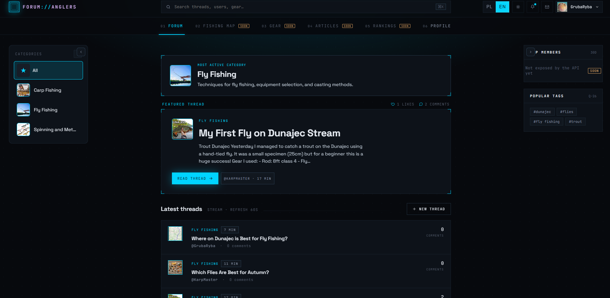 | 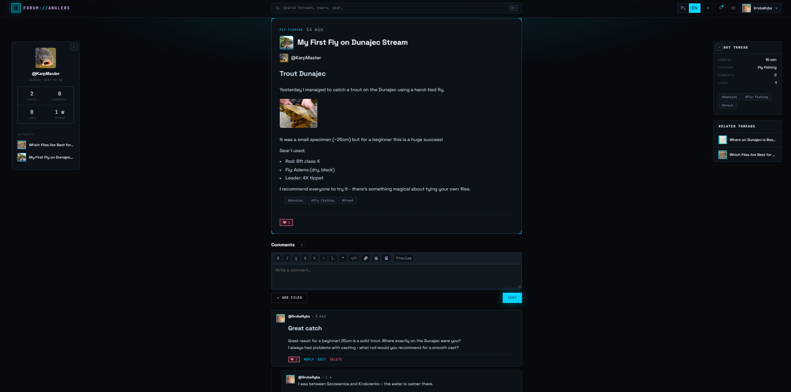 |
| **Markdown editor** | **Logs** |
| 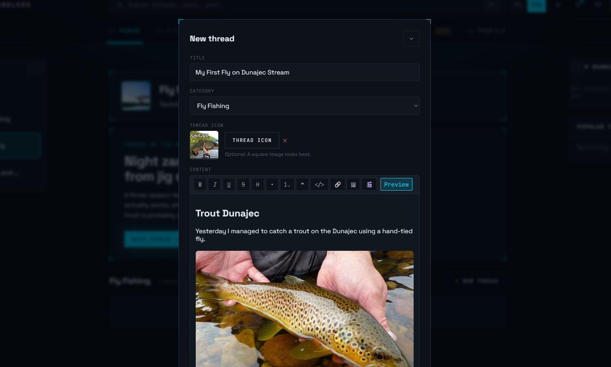 | 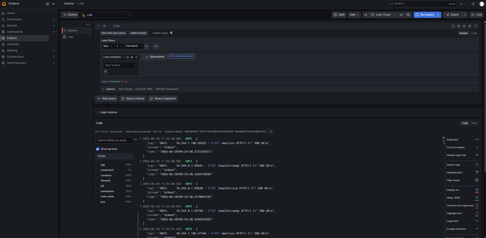 |
| **Swagger UI (`/docs`)** | **Grafana dashboard** |
| 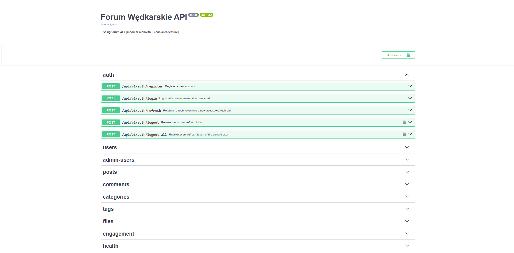 | 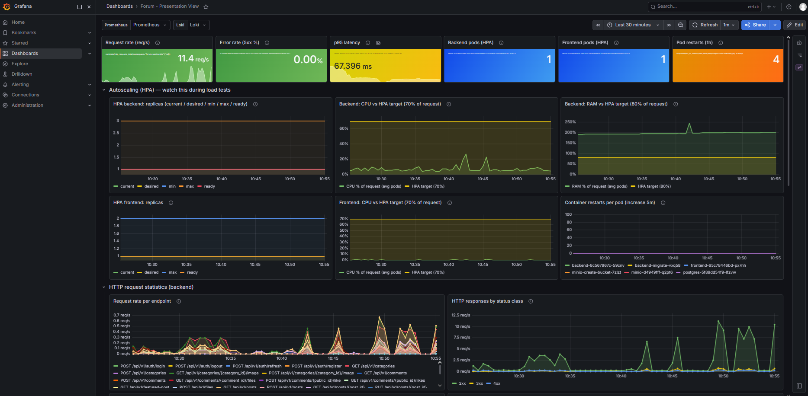 |
| **MinIO** | **Load test results** |
| 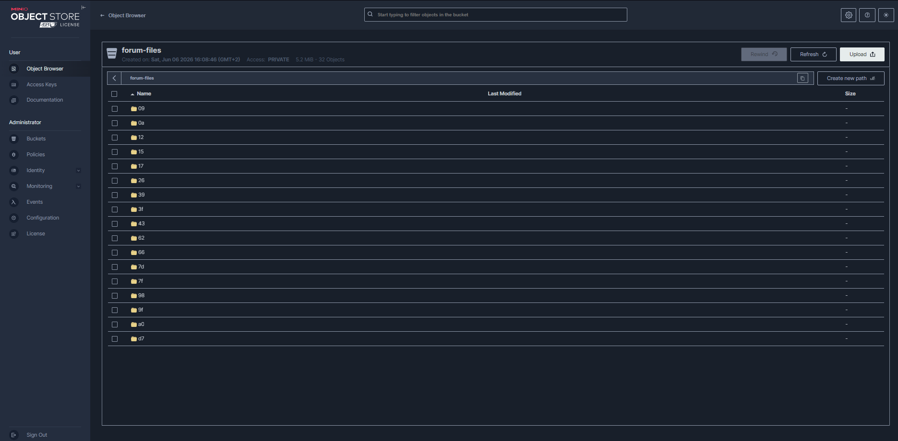 | 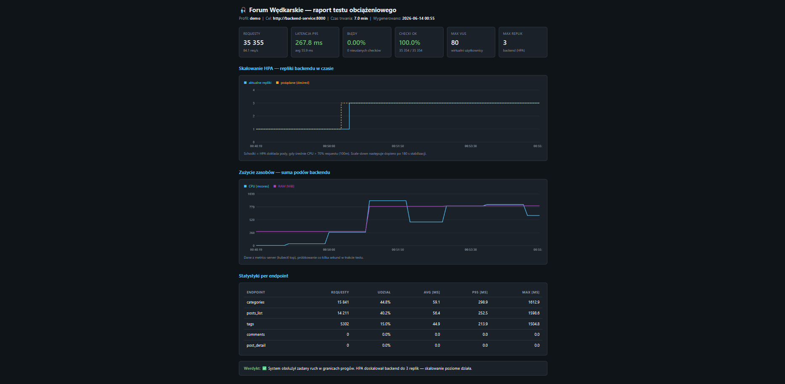 |
---

## ✨ Features

### 🔐 Accounts & authentication (`identity` module)

- Registration with validation of username, e-mail and **password policy** (min. 8 chars, common-password blocklist per NIST SP 800-63B).
- **JWT login**: short-lived access token (15 min) + long-lived refresh token (14 days).
- **Refresh-token rotation with reuse detection** — a stolen token is detected and invalidates the entire session.
- Logout from the current device and **logout from all devices**.
- **RBAC + ACL**: roles (`user` < `moderator` < `admin`) plus per-user permission overrides.

### 📝 Content (`content` module)

- Create / edit / soft-delete posts; **Markdown** content with safe rendering.
- **Categories** with custom icons; any logged-in user can create a category and manage its icon.
- **Tags** and filtering of the post list by category, tag or author.
- **Nested comments** (reply tree) via the **materialized-path** technique — the whole thread is fetched in a single query.
- **Full-Text Search** of posts backed by a PostgreSQL `tsvector` column with a GIN index and field weights (title > body).
- **Keyset (cursor) pagination** — efficient and stable even on large datasets.

### 📎 Files (`files` module)

- Upload to **MinIO** (S3-compatible) — images, video, audio, documents.
- Two upload modes: **proxied** (through the backend) and **presigned** (direct to MinIO); MIME whitelist + content sniffing (`libmagic`).
- Image **thumbnail** generation (Pillow), user avatars, category & thread icons.
- Automatic **orphan-file cleanup** (CronJob) after a retention window.

### 👍 Engagement (`engagement` module)

- **Likes** on posts and comments (idempotent).
- **User statistics** (posts, comments, likes received, join date) computed by a database **view** `user_stats`.
- Featured ("most-liked") thread.

---

## 🏛 Architecture

### Clean Architecture

The backend follows **Clean Architecture** with a strict **dependency rule**: code may
depend only on more inner layers. The direction is
`domain ← application ← infrastructure/presentation`. The domain layer imports nothing from
any framework, which makes business logic fully testable in isolation and lets you swap
technical details (database, HTTP framework, object storage) without touching the domain.

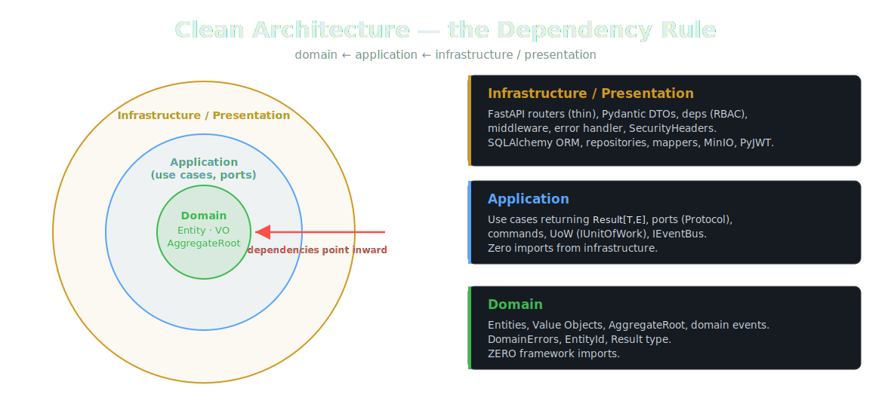

| Layer | Responsibility | Example artifacts |
|-------|----------------|-------------------|
| **domain** | Business rules, technology-agnostic. | `Entity`, `ValueObject`, `AggregateRoot`, `DomainEvent`, `DomainError` |
| **application** | Use-case orchestration, port definitions. | `use_cases/`, `ports.py`, `commands.py`, `Result[T, E]` |
| **infrastructure** | Port implementations: DB, JWT, hashing, MinIO. | `orm/`, `repositories/`, `mappers.py`, `unit_of_work.py` |
| **presentation** | HTTP entry point: routers, DTOs, deps, middleware. | `routers/`, `dto/`, `deps.py`, `middleware/` |

### Modular Monolith

The application is divided into four active domain modules — `identity`, `content`, `files`
and `engagement` — plus two empty skeletons (`notifications`, `audit`) prepared for upcoming
phases (RabbitMQ, WebSocket). Modules communicate through **domain events** published on an
event bus rather than via direct calls, keeping coupling loose.

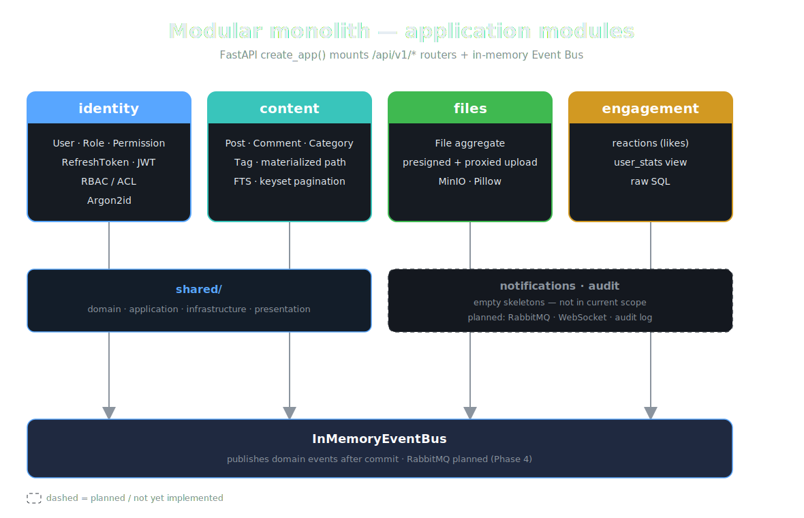

### Request Lifecycle

Each request flows through the layers in a strict order. A thin router maps the DTO to a
command and checks permissions, then calls a use case that operates on a domain aggregate and
persists changes through a repository within a Unit of Work. The result is returned as
`Result[T, DomainError]` — success maps to an HTTP response, a domain error maps to the
appropriate status code in a global handler.

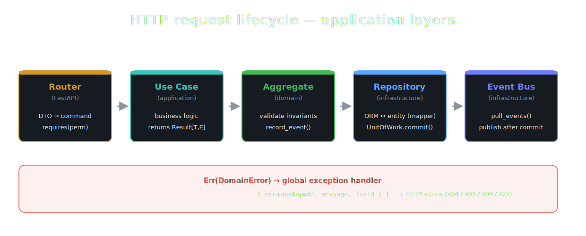

---

## 🧰 Tech Stack

| Layer | Technologies |
|-------|--------------|
| **Language & framework** | Python 3.12, FastAPI, Starlette, Uvicorn |
| **ORM & database** | SQLAlchemy 2.0, Alembic, PostgreSQL 16 (psycopg3) |
| **Validation** | Pydantic v2, pydantic-settings |
| **Security** | PyJWT, argon2-cffi (Argon2id), python-magic |
| **Files** | MinIO (S3), Pillow |
| **Frontend** | React 18, Vite, TanStack React Query, React Router, axios, markdown-it, DOMPurify |
| **Package managers** | uv (backend), pnpm (frontend) |
| **Containerization** | Docker (multi-stage), Docker Compose |
| **Orchestration** | Kubernetes (minikube), Helm |
| **Observability** | Prometheus, Grafana, Loki, structlog |
| **Testing** | pytest, pytest-asyncio, httpx, k6 |
| **Code quality** | ruff, mypy (`--strict`) |

---

## 🗄 Database Schema

The schema comprises 14 tables and one view. The central entity is the users table, around
which the RBAC/ACL subsystem, content (posts, comments, categories, tags), files and reactions
are organized.


| Table / view | Role |
|--------------|------|
| `users` | User accounts (int id + public UUID, Argon2 hash, status). |
| `roles`, `permissions` | RBAC dictionaries. |
| `role_permissions` | Which permissions each role has. |
| `user_roles` | Role assignments to users. |
| `user_permissions` | Per-user permission overrides (grant/deny — ACL). |
| `refresh_tokens` | Whitelist of issued refresh tokens (status, rotation, `jti`). |
| `categories` | Topic categories (`owner_id`, `icon_file_id`). |
| `posts` | Posts (`slug`, `content_format`, `is_deleted`, `search_tsv`). |
| `comments` | Comments with materialized path (`path`, `depth`, self-FK `parent_id`). |
| `tags`, `post_tags` | Tags and the post↔tag join table. |
| `files` | File metadata in MinIO (`sha256`, `owner_type`, `storage_key`). |
| `reactions` | Polymorphic likes (`target_type` post/comment + `target_id`). |
| `user_stats` *(view)* | Per-user statistics computed on the fly. |

> The schema is managed entirely by **Alembic migrations** (`0001`–`0009`). The app does
> **not** use `Base.metadata.create_all` to avoid drift between the ORM model and the real database.

---

## 🚀 Getting Started

### Prerequisites

Make sure the following are installed before you start:

| Tool | Version | Needed for |
|------|---------|------------|
| **Docker** + **Docker Compose** | 24+ | Option A (recommended) |
| **Python** | 3.12+ | Option B (local backend) |
| **uv** | latest | Backend dependency management ([install guide](https://docs.astral.sh/uv/)) |
| **Node.js** + **pnpm** | Node 20+, pnpm 9+ | Option B (local frontend) |
| **minikube** + **kubectl** | latest | Option C (Kubernetes) |
| **Helm** | 3+ | Option C (monitoring stack) |
| **k6** | latest | Load testing (optional) |

### Clone the repository

```bash
git clone https://github.com/JakubPatkowski/Python-Forum-API.git
cd Python-Forum-API
```

### Option A — Docker Compose (recommended)

The fastest way to run the entire stack (PostgreSQL, backend with migrations, MinIO,
bucket-creation job, frontend) with a single command:

```bash
docker compose up --build
```

Once the containers are healthy, the following endpoints are available:

| Service | URL |
|---------|-----|
| **Frontend** | http://localhost:3000 |
| **Backend API** | http://localhost:8000 |
| **Swagger UI** | http://localhost:8000/docs |
| **MinIO console** | http://localhost:9001 (login: `minioadmin` / `minioadmin`) |

> The backend container runs `alembic upgrade head` on boot and then starts Uvicorn with
> hot-reload, so code changes under `./backend` are picked up automatically.

To stop and remove everything (including volumes — useful after a schema-changing migration):

```bash
docker compose down -v
```

### Option B — Local development (without Docker)

Run PostgreSQL and MinIO however you prefer (or just reuse the Compose services for them),
then start backend and frontend natively.

**Backend:**

```bash
cd backend
uv sync                              # install dependencies into a virtualenv
uv run alembic upgrade head          # apply migrations
uv run uvicorn app.main:app --reload # start dev server on :8000
```

Create a `backend/.env` with at least a `DATABASE_URL` and a `SECRET_KEY` (see
[Configuration](#-configuration)). For local dev you can set `DEBUG=true` to relax the
insecure-secret-key guard.

**Frontend:**

```bash
cd frontend
pnpm install
pnpm dev                             # Vite dev server on :5173
```

### Option C — Kubernetes (minikube)

Deploy a production-like setup to a local minikube cluster.

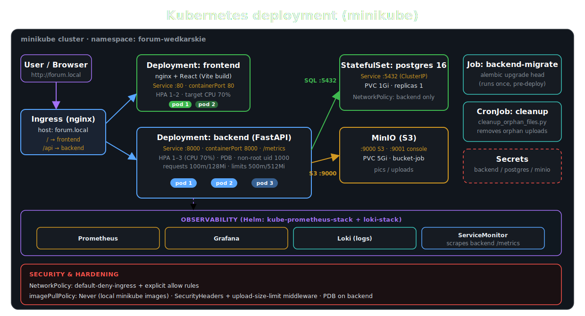

```bash
# 1. Start the cluster (give it enough resources for the monitoring stack)
minikube start --cpus=6 --memory=10g
minikube addons enable metrics-server
minikube addons enable ingress

# 2. Build images directly into minikube's Docker daemon
#    (manifests use imagePullPolicy: Never)
eval $(minikube docker-env)
docker build -t forum-wedkarskie-backend:latest ./backend
docker build -t forum-wedkarskie-frontend:latest ./frontend

# 3. Namespace + secrets (copy the *.example.yaml files and fill in values)
kubectl apply -f k8s/namespace.yaml

# 4. Database first, then run migrations as a Job BEFORE the backend rollout
kubectl apply -f k8s/postgres/
kubectl wait pod -l app=postgres -n forum-wedkarskie --for=condition=ready --timeout=120s
kubectl delete job backend-migrate -n forum-wedkarskie --ignore-not-found
kubectl apply -f k8s/backend/migration-job.yaml
kubectl wait --for=condition=complete job/backend-migrate -n forum-wedkarskie --timeout=180s

# 5. Everything else (deployment, service, hpa, pdb, cronjob, frontend, minio, ingress)
kubectl apply -f k8s/backend/
kubectl apply -f k8s/frontend/
kubectl apply -f k8s/minio/
kubectl apply -f k8s/ingress/
kubectl apply -f k8s/network-policies/

# 6. Access the app
echo "$(minikube ip)  forum.local" | sudo tee -a /etc/hosts
# open http://forum.local
```

> Migrations run as a Kubernetes **Job** (not an initContainer) so that with multiple
> replicas no pod races for the migration lock, and failures surface clearly in
> `kubectl get jobs`. A convenience script that brings up the whole stack (build,
> deploy, monitoring, port-forwards) is provided in `scripts/start-demo.sh`.

**Install the monitoring stack (Helm):**

```bash
helm repo add prometheus-community https://prometheus-community.github.io/helm-charts
helm repo add grafana https://grafana.github.io/helm-charts
helm install monitoring prometheus-community/kube-prometheus-stack \
  -n monitoring --create-namespace -f k8s/monitoring/values-kube-prometheus-stack.yaml
helm install loki grafana/loki-stack \
  -n monitoring -f k8s/monitoring/values-loki-stack.yaml
kubectl apply -f k8s/monitoring/
```

---

## ⚙️ Configuration

Backend configuration is loaded from environment variables / a `.env` file via
`pydantic-settings`. The most important keys:

| Variable | Default | Description |
|----------|---------|-------------|
| `DATABASE_URL` | `postgresql+psycopg://...` | PostgreSQL DSN (**must** use the `psycopg` driver). |
| `SECRET_KEY` | *(guarded)* | JWT signing key. App refuses to start outside `DEBUG` with the default value. |
| `DEBUG` | `false` | Enables debug logging and relaxes the secret-key guard. |
| `ACCESS_TOKEN_EXPIRE_MINUTES` | `15` | Access-token lifetime. |
| `REFRESH_TOKEN_EXPIRE_DAYS` | `14` | Refresh-token lifetime. |
| `DB_POOL_SIZE` / `DB_MAX_OVERFLOW` | `10` / `10` | Connection-pool budget (`replicas × (size+overflow) < max_connections`). |
| `DB_POOL_TIMEOUT_SECONDS` | `5` | Fail fast instead of hanging on an exhausted pool. |
| `MAX_UPLOAD_SIZE_BYTES` | `26214400` | Upload size limit (25 MB). |
| `MINIO_ENDPOINT` / `MINIO_PUBLIC_ENDPOINT` | `localhost:9000` | Internal vs. browser-facing MinIO endpoint (for presigned URLs). |
| `CORS_ALLOW_ORIGINS` | `localhost:3000,5173,forum.local` | Explicit CORS origins (required with credentials). |

> 🔒 **Never commit real secrets.** In Kubernetes the JWT key and MinIO/Postgres credentials
> are injected as `Secret` objects (`backend-secrets`, `minio-secret`, `postgres-secret`).
> Use the provided `*.example.yaml` files as templates.

---

## 🔌 API Overview

All endpoints are versioned under `/api/v1`. Interactive documentation is available at
`/docs` (Swagger UI) and `/redoc` when the backend is running.

> 📖 **Live API reference.** A **Redoc** site is auto-generated from the OpenAPI schema on
> every push to `master` (the `api-docs.yml` workflow) and published to GitHub Pages:
> **[jakubpatkowski.github.io/Python-Forum-API](https://jakubpatkowski.github.io/Python-Forum-API/)**

[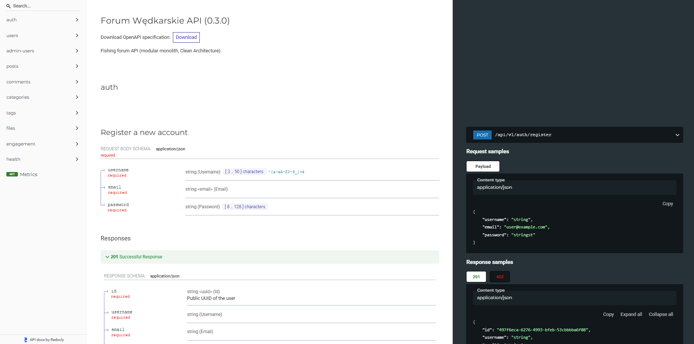](https://jakubpatkowski.github.io/Python-Forum-API/)

| Module | Selected endpoints |
|--------|--------------------|
| **auth** | `POST /auth/{register,login,refresh,logout,logout-all}` |
| **users** | `GET /users/me`, `GET/PATCH /users/*` |
| **admin** | `GET/PATCH /admin/users/*` (roles, permissions, status) |
| **posts** | `GET/POST/PUT/DELETE /posts` (UUID ids, keyset `?cursor=&limit=`) |
| **comments** | `GET/POST/PUT/DELETE /comments` (tree) |
| **categories** | `GET/POST/DELETE /categories` |
| **tags** | `GET/POST /tags` |
| **files** | `POST /files`, `GET /files/{id}`, `GET /files/mine`, avatars/icons |
| **engagement** | `POST/DELETE /{posts,comments}/{id}/like`, `GET /users/{id}/stats` |
| **health** | `GET /`, `/health`, `/health/live`, `/health/ready` |

All errors share a uniform envelope:

```json
{ "error": { "code": "VALIDATION_ERROR", "message": "...", "field": "email" } }
```

---

## 🛡 Security

Security was treated as a first-class requirement at every level — from password policy,
through token flow, to network isolation in the cluster.

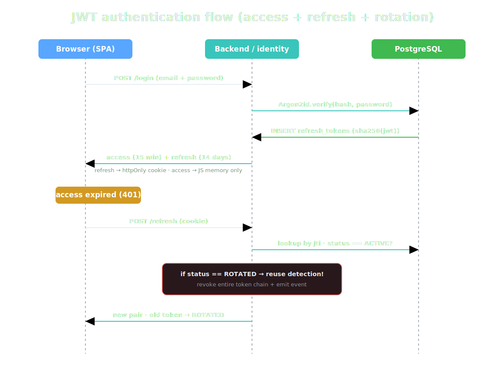

- **JWT with rotation & reuse detection** — every refresh-token use swaps it for a new one;
  re-presenting a rotated token is treated as theft and invalidates the whole session chain.
- **RBAC + ACL** — effective permissions = `(∪ role permissions) ∪ grants \ denies`.
- **Argon2id** password hashing (RFC 9106 profile), per-hash salt, automatic rehash.
- **Generic "invalid credentials"** — never reveals whether the username or password was wrong.
- **Security headers middleware** — `X-Frame-Options: DENY`, `X-Content-Type-Options: nosniff`,
  HSTS, `Referrer-Policy: no-referrer`, `Content-Security-Policy: default-src 'self'`.
- **Upload guard middleware** — rejects oversized / malformed uploads (411/400/413) before
  reading the request body; MIME whitelist + content sniffing blocks executables and HTML.
- **Fail-fast secret-key guard** — refuses to start with the default JWT key outside `DEBUG`.
- **Cluster hardening** — pods run as non-root (uid 1000), `readOnlyRootFilesystem`,
  `drop: ALL` capabilities; `NetworkPolicy` default-deny + explicit allow rules; secrets
  injected via Kubernetes `Secret`.

---

## 🧪 Testing

### Unit & integration tests

Tests run with `pytest` (plus `pytest-asyncio` and `httpx.AsyncClient` / `TestClient` for
HTTP-level tests). The suite is layered to match Clean Architecture:

- **unit** — pure domain (aggregates, value objects, materialized path, keyset cursor) and the
  full **application layer** (every use case) driven through in-memory fakes — no I/O, runs in
  seconds. The *real* Argon2 hasher and PyJWT service are used so signing and refresh-token
  reuse-detection are genuinely exercised.
- **e2e (HTTP)** — the real FastAPI app via `TestClient` with the DI container overridden by
  fakes: routing, request/response DTOs, status codes, the error envelope and the auth
  dependencies (401 / 403 gates).
- **integration** — the SQLAlchemy repositories, mappers and unit-of-work against a **real
  Postgres** spun up with `testcontainers` (requires Docker; run in CI).

```bash
cd backend
uv run pytest                      # run everything (needs Docker for integration)
uv run pytest -m "not integration" # fast suite, no Docker
uv run pytest --cov=app            # with coverage
```

#### 📊 Test & coverage summary

The table below is **generated automatically** on every backend CI run by
[`scripts/test_summary.py`](scripts/test_summary.py), which parses the
`coverage.xml` (Cobertura) and JUnit reports and injects the result between the markers below.
It is also written to the GitHub Actions **job summary** of each run.

<!-- TEST-SUMMARY:START -->

 [](https://app.codecov.io/gh/JakubPatkowski/Python-Forum-API) [](https://app.codecov.io/gh/JakubPatkowski/Python-Forum-API/tests/master)

**233 automated tests** — 233 passed, 0 failed, 0 skipped · **75% line coverage** · ✅ all passing

_Auto-generated from `coverage.xml` + JUnit by `scripts/test_summary.py` on each backend CI run._

**Tests by suite**

| Suite | Tests | Passed | Failed | Skipped |
|-------|:-----:|:------:|:------:|:-------:|
| `e2e (HTTP)` | 11 | 11 | 0 | 0 |
| `integration / files` | 12 | 12 | 0 | 0 |
| `unit / content` | 99 | 99 | 0 | 0 |
| `unit / files` | 39 | 39 | 0 | 0 |
| `unit / identity` | 61 | 61 | 0 | 0 |
| `unit / shared` | 11 | 11 | 0 | 0 |
| **Total** | **233** | **233** | **0** | **0** |

**Line coverage by module**

| Module | Coverage | |
|--------|:--------:|--|
| `identity` | 79% | `████████░░` |
| `content` | 77% | `████████░░` |
| `files` | 67% | `███████░░░` |
| `engagement` | 47% | `█████░░░░░` |
| `shared` | 92% | `█████████░` |
| **overall** | **75%** | `███████░░░` |

<!-- TEST-SUMMARY:END -->

> Numbers above reflect the fast (non-Docker) suite. CI additionally runs the `testcontainers`
> integration tests and regenerates this block, so the live figures (incl. repository/mapper
> coverage) are higher.

### Coverage (Codecov)

Both suites upload to **[Codecov](https://codecov.io/gh/JakubPatkowski/Python-Forum-API)** on
every backend CI run. The unit and integration runs are uploaded as separate **flags** and
merged per commit; coverage is additionally split into **components** — one per domain module
(`identity`, `content`, `files`, `engagement`, `shared`) — so it's easy to spot which module
needs more tests. **Test Analytics** (JUnit results) tracks run times and flaky tests.

[](https://codecov.io/gh/JakubPatkowski/Python-Forum-API)
[](https://app.codecov.io/gh/JakubPatkowski/Python-Forum-API/components)

<a href="https://app.codecov.io/gh/JakubPatkowski/Python-Forum-API">
  
</a>

- **Coverage dashboard & file browser** → <https://app.codecov.io/gh/JakubPatkowski/Python-Forum-API>
- **Components** (per-module coverage: identity / content / files / engagement / shared) → <https://app.codecov.io/gh/JakubPatkowski/Python-Forum-API/components>
- **Test Analytics** (run times, failure rates, flaky-test detection from the uploaded JUnit results) → <https://app.codecov.io/gh/JakubPatkowski/Python-Forum-API/tests/master>

> The sunburst is rendered live by Codecov from the latest `master` upload (inner ring = repo
> root, each outer segment = a folder/file, coloured by coverage) — click it for the interactive
> grid/icicle views. The numeric table above is generated in CI by `scripts/test_summary.py`.

### Load testing (k6)

Load tests use **k6**, run as a Kubernetes Job. Three profiles are tuned for a 16 GB RAM
machine: `smoke` (1 VU / 30 s), `demo` (stepped ramp 10 → 40 → 80 VU, ~7 min — showcases HPA
scaling) and `stress` (up to 150 VU).

```bash
# Local run against an exposed ingress
k6 run -e BASE_URL=http://forum.local -e PROFILE=demo load/k6-load-test.js

# Or via the provided wrapper (samples HPA/CPU, generates an HTML report)
bash scripts/run-load-test.sh demo
```

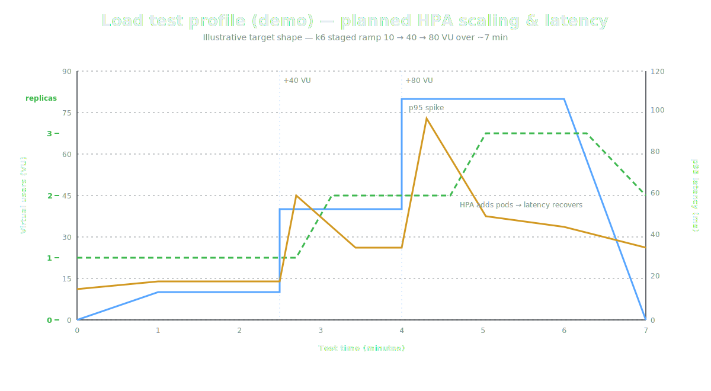

**Results (profile `demo`, three runs).** A clear improvement after tuning the connection
pool — p95 latency dropped from 169 ms to 71 ms and errors were eliminated:

| Metric | Run 1 | Run 2 | Run 3 (tuned) |
|--------|------:|------:|------:|
| Requests | 32,806 | 32,718 | **37,853** |
| Throughput [req/s] | 78.0 | 77.9 | **90.1** |
| Latency median [ms] | 8.3 | 7.5 | **6.6** |
| Latency p90 [ms] | 84.3 | 46.6 | **33.9** |
| Latency p95 [ms] | 169.4 | 108.8 | **71.4** |
| Error rate | 0.10 % | 0.10 % | **0.00 %** |
| Max replicas (HPA) | 3 | 3 | 3 |
| Max VUs | 80 | 80 | 80 |

> The HPA correctly scales the backend from 1 → 3 replicas under load and scales back in after
> the peak (180 s stabilization window). A sample k6 HTML report lives in `load/results/`.

---

## 📊 Monitoring & Observability

Built on the standard CNCF stack: **Prometheus** (metrics), **Grafana** (dashboards), **Loki**
(logs) and **structlog** (structured app logging).

- The backend exposes Prometheus metrics at `/metrics` via `prometheus-fastapi-instrumentator`;
  Prometheus discovers the target through a `ServiceMonitor` and scrapes every 15 s.
- **Alert rules** cover common production problems: `BackendDown`, `BackendHighErrorRate`,
  `BackendHighLatencyP95`, `BackendHPAMaxedOut`.
- Two Grafana dashboards visualize request rate, latency, pod CPU/memory and HPA replica count.
- Structured JSON logs (e.g. `upload_rejected_too_large`, `readiness_check_failed`) are
  collected by Loki and correlated with metrics in Grafana.

| Grafana dashboard | HPA scaling |
|:---:|:---:|
|  | 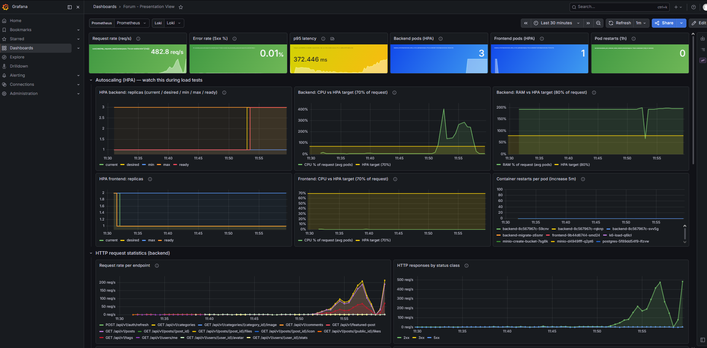 |

---

## 🔄 CI/CD Pipeline

Continuous integration and delivery run entirely on **GitHub Actions** — eight workflows
triggered on push, pull request and a weekly schedule. Status badges at the top of this
README reflect their live results. Full details are in
[`docs/23-ci-cd-github-actions.md`](./docs/23-ci-cd-github-actions.md).

| Workflow | Trigger | What it does |
|----------|---------|--------------|
| **Backend CI** (`ci-backend.yml`) | push / PR on `backend/**` | Ruff lint + format, `mypy --strict`, pytest (unit + testcontainers integration), coverage → Codecov |
| **Frontend CI** (`ci-frontend.yml`) | push / PR on `frontend/**` | pnpm install (frozen), ESLint, production Vite build, artifact upload |
| **Docker Images** (`docker-build.yml`) | push to `master`, tags, PR | Multi-stage build of backend & frontend; pushes to **GHCR** (`ghcr.io`) on non-PR |
| **E2E (kind)** (`e2e-kind.yml`) | push / PR | Spins up an ephemeral **kind** cluster, deploys the real `k8s/` manifests, smoke-tests via port-forward |
| **CodeQL** (`codeql.yml`) | push / PR / weekly | GitHub-native SAST for Python + JS/TS (`security-extended`) → Security tab |
| **Security Scan** (`security.yml`) | push / PR / weekly | **Trivy** (deps, secrets, IaC) + **Gitleaks** (history) → SARIF in Security tab |
| **Performance (k6)** (`performance.yml`) | push / PR on `backend/**`, `load/**` | Brings up the stack with Compose, runs the k6 `smoke` profile with enforced thresholds |
| **API Docs** (`api-docs.yml`) | push to `master` on `backend/**` | Exports OpenAPI, renders a Redoc site, deploys to **GitHub Pages** |

> Security and CodeQL scanners report findings as SARIF to the repository's **Security** tab;
> they never block the build (visibility, not a hard gate). Lint, type-check, tests, build
> and E2E are the gating checks.

---

## 📁 Project Structure

```text
.
├── backend/                     # FastAPI backend (Clean Architecture)
│   ├── app/
│   │   ├── main.py              # create_app(): mounts /api/v1/* routers
│   │   ├── config.py            # pydantic-settings configuration
│   │   ├── container.py         # Dependency Injection (use-case providers)
│   │   ├── shared/              # base classes for all layers
│   │   │   ├── domain/          # Entity, AggregateRoot, ValueObject, errors
│   │   │   ├── application/     # IRepository, IUnitOfWork, IEventBus, Result
│   │   │   ├── infrastructure/  # db session, in-memory event bus, logging
│   │   │   └── presentation/    # api_response, error_handler, middleware
│   │   ├── modules/             # identity | content | files | engagement
│   │   │   └── <module>/
│   │   │       ├── domain/      # aggregates, value objects, events
│   │   │       ├── application/ # ports.py, commands.py, use_cases/
│   │   │       ├── infrastructure/ # orm/, repositories/, mappers, unit_of_work
│   │   │       └── presentation/   # routers/, dto/, deps.py
│   │   └── maintenance/         # cleanup_orphan_files.py (CronJob)
│   ├── alembic/versions/        # migrations 0001..0009
│   ├── tests/                   # unit / integration / e2e
│   └── Dockerfile               # multi-stage build with uv
├── frontend/                    # React 18 + Vite SPA
│   └── src/
│       ├── api/                 # axios client + interceptors, resource fns
│       ├── auth/                # AuthContext, ProtectedRoute
│       ├── query/               # React Query client + key factory
│       ├── hooks/               # data hooks (content, engagement, files, admin)
│       ├── components/          # Markdown, editor, modals, comments, files
│       └── pages/               # Home, Post, Profile, Login, Register, Admin
├── k8s/                         # Kubernetes manifests
│   ├── backend/                 # deployment, service, hpa, pdb, migration-job
│   ├── frontend/  postgres/  minio/  ingress/
│   ├── network-policies/        # default-deny + allow rules
│   └── monitoring/              # ServiceMonitor, dashboards, Helm values
├── load/                        # k6 load tests + HTML report template
├── docs/                        # full architecture & ops documentation
├── scripts/                     # start-demo / run-load-test / seed / validate (bash, WSL/Linux)
└── docker-compose.yml
```

---

## 🛠 Useful Commands

| Goal | Command |
|------|---------|
| Install backend deps | `uv sync` |
| Run migrations | `uv run alembic upgrade head` |
| Dev server | `uv run uvicorn app.main:app --reload` |
| Lint | `uv run ruff check .` |
| Type-check | `uv run mypy app/` |
| Tests | `uv run pytest` |
| Frontend dev | `pnpm install && pnpm dev` |
| Start full stack (demo) | `bash scripts/start-demo.sh` |
| Seed demo data | `bash scripts/seed-test-data.sh http://localhost:8000` |
| Validate cluster health | `bash scripts/validate-app.sh` |
| Reset DB (k8s) | `kubectl delete pvc postgres-pvc -n forum-wedkarskie && kubectl rollout restart deploy/postgres -n forum-wedkarskie` |
| Load test | `bash scripts/run-load-test.sh demo` |

---

## 🗺 Roadmap

The architecture was intentionally prepared for future phases.

- [x] **Phase 0** — Bootstrap (uv, `shared/`, Alembic, `create_app()`, multi-stage Dockerfile)
- [x] **Phase 1** — `identity` (JWT access+refresh+rotation+reuse-detection, RBAC+ACL, Argon2)
- [x] **Phase 2** — `content` (posts/comments with materialized path, categories, tags, FTS, keyset)
- [x] **Phase 3** — `files` (MinIO upload, thumbnails, avatars, icons)
- [x] **Engagement** — likes, `user_stats` view, category ownership
- [x] **Frontend** — full API integration (auth, content, uploads, admin, likes, i18n)
- [x] **K8s hardening** — HPA / PDB / NetworkPolicy / Ingress / securityContext / Secrets
- [x] **Observability** — Prometheus + Grafana + Loki + k6 load tests
- [x] **Phase 9** — CI/CD pipeline (8 GitHub Actions workflows: CI, GHCR images, CodeQL + Trivy + Gitleaks, kind E2E, k6, API docs)
- [ ] **Phase 4** — RabbitMQ event bus + `notifications` + `audit` modules
- [ ] **Phase 5** — Real-time notifications over WebSocket

---

## 📚 Documentation

The [`docs/`](./docs) directory contains the full architecture and operations
documentation, organized by topic ([`docs/README.md`](./docs/README.md) is the index):

| Document | Topic |
|----------|-------|
| [`01-architecture.md`](./docs/01-architecture.md) | Clean Architecture, layers, modules, ADRs |
| [`02-database.md`](./docs/02-database.md) | Schema, Alembic migrations, views |
| [`03-security.md`](./docs/03-security.md) | JWT, RBAC + ACL, Argon2, hardening |
| [`04-deployment.md`](./docs/04-deployment.md) | Kubernetes, Docker, operations |
| [`05-monitoring.md`](./docs/05-monitoring.md) | Prometheus, Grafana, Loki |
| [`06-testing.md`](./docs/06-testing.md) | pytest & k6 load testing |
| [`07-development.md`](./docs/07-development.md) | Local setup, conventions, roadmap |
| [`22-test-data-seed.md`](./docs/22-test-data-seed.md) | Seeding demo data for screenshots & demos |
| [`23-ci-cd-github-actions.md`](./docs/23-ci-cd-github-actions.md) | CI/CD pipeline — all 8 GitHub Actions workflows |

---

## 🤝 Contributing

This is an academic project, but contributions and suggestions are welcome.

1. Fork the repository and create a feature branch (`git checkout -b feature/my-feature`).
2. Make your changes; keep the code style (`ruff`, `mypy --strict`) and add tests.
3. Run the full check locally: `uv run ruff check . && uv run mypy app/ && uv run pytest`.
4. Open a pull request describing the change.

Code, comments, and public APIs are written in English; the forum UI is in Polish.

---

## 📄 License

Distributed under the **MIT License**. See [`LICENSE`](./LICENSE) for details.

---

<div align="center">

**Forum Wędkarskie** · built with Python, FastAPI & React · deployed on Kubernetes

Made by [Jakub Patkowski](https://github.com/JakubPatkowski)

</div>
