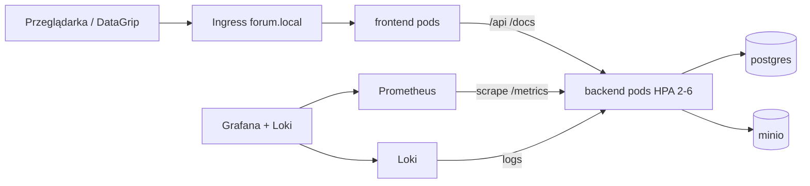

# 12 — Raport: Kubernetes, monitoring, uruchomienie i testy

> **Cel dokumentu.** Podsumowanie tego, co zostało zrobione w sesji stabilizacji K8s
> (w tym przerwanej przez limit tokenów u Claude Opus), co **faktycznie leży w repo**,
> czego **jeszcze brakuje**, oraz **praktyczny runbook**: Docker Compose, minikube,
> panele (Grafana, dashboard K8s, Swagger, MinIO, DataGrip), testy aplikacji i demo
> autoskalowania.
>
> Data: 2026-06-04 · wersja kodu ~0.3.0 · **ten plik niczego nie zmienia w kodzie**.
>
> Powiązane dokumenty:
> - [`10-raport-stabilizacji-i-zamkniecia.md`](./10-raport-stabilizacji-i-zamkniecia.md) — plan zaliczeniowy sprzed hardeningu K8s
> - [`11-raport-audytu-backend-k8s.md`](./11-raport-audytu-backend-k8s.md) — audyt z 2026-06-04 (część usterek **już naprawiona** w manifestach)
> - [`06-uruchomienie-lokalne-i-minikube.md`](./06-uruchomienie-lokalne-i-minikube.md) — **przestarzały** (pgAdmin, brak MinIO/monitoring/HPA)

---

## 0. TL;DR — co się stało z zadaniem dla Claude

Sesja Claude Opus 4.8 **dowiozła większość plików infrastruktury**, ale **skończyła się na limicie tokenów** zanim domknęła integrację operacyjną (skrypty deploy/port-forward, README, pełny runbook w jednym miejscu).

| Obszar | Stan w repo | Uwaga |
|--------|-------------|--------|
| Hardening manifestów (securityContext, probes, resources) | ✅ Zrobione | backend, postgres, minio, frontend |
| `SECRET_KEY` poza ConfigMap | ✅ Zrobione | `backend-secrets` + `scripts/generate-secrets.ps1` |
| Probes live/ready + DB w `/health/ready` | ✅ Zrobione | kod + `k8s/backend/deployment.yaml` |
| HPA backend + frontend | ✅ Zrobione | `k8s/backend/hpa.yaml`, `k8s/frontend/hpa.yaml` |
| PDB | ✅ Zrobione | `k8s/backend/pdb.yaml` |
| Monitoring (Helm values, ServiceMonitor, dashboard, alerty) | ✅ Pliki gotowe | wymaga `scripts/install-monitoring.ps1` + Helm |
| Ingress `forum.local` / `grafana.local` | ✅ Manifesty | wymaga `minikube addons enable ingress` + wpis w `hosts` |
| NetworkPolicy (postgres + opcjonalny full-lockdown) | ✅ Manifesty | **egzekucja** tylko z CNI typu Calico |
| Load test k6 | ✅ `load/` + `scripts/run-load-test.ps1` | |
| **`scripts/deploy.ps1`** | ⚠️ **Nie zaktualizowany** | nadal bez MinIO, HPA, secretów, ingressu, metrics-server |
| **`scripts/portforward.ps1`** | ⚠️ **Nie zaktualizowany** | nadal pgAdmin (usunięty z `k8s/`) |
| **`scripts/scaling-demo.ps1`** | ❌ **Brak pliku** | wspomniany w `run-load-test.ps1`, nie istnieje |
| README / docs/06 | ⚠️ Częściowo stare | pgAdmin, brak pełnej ścieżki K8s |

**Wniosek:** Infrastruktura pod zaliczenie K8s jest w repozytorium; **musisz wdrożyć ręcznie według sekcji 5** (albo uzupełnić `deploy.ps1` w osobnej sesji).

---

## 1. Mapa plików — co gdzie leży

### 1.1. Kubernetes (`k8s/`)

```
k8s/
├── namespace.yaml
├── postgres/          deployment, pvc, service, secret.example.yaml
├── backend/           deployment, service, configmap, hpa, pdb, migration-job,
│                      cleanup-cronjob, uploads-pvc, secret.example.yaml
├── frontend/          deployment, service, configmap (nginx → proxy /api, /docs)
├── minio/             deployment, service (NodePort 30900/30901), pvc, create-bucket-job
├── ingress/
│   ├── ingress-app.yaml          → http://forum.local (frontend + Swagger przez nginx)
│   └── ingress-monitoring.yaml   → http://grafana.local (opcjonalnie)
├── monitoring/
│   ├── values-kube-prometheus-stack.yaml
│   ├── values-loki-stack.yaml
│   ├── servicemonitor-backend.yaml
│   ├── prometheus-rules.yaml
│   └── grafana-dashboard-forum.yaml   (ConfigMap → dashboard „Forum Overview”)
├── network-policies/
│   ├── postgres-allow-backend.yaml    ← bezpieczny default (zalecany)
│   └── full-lockdown/                 ← opcjonalny, restrykcyjny zestaw (4 pliki)
└── (brak pgadmin/)                    ← usunięte; baza przez DataGrip + port-forward
```

### 1.2. Skrypty (`scripts/`)

| Skrypt | Rola |
|--------|------|
| `generate-secrets.ps1` | Tworzy `backend-secrets`, `postgres-secret`, `minio-secret` |
| `deploy.ps1` | **Częściowy** deploy (postgres + migrate + backend/frontend) |
| `install-monitoring.ps1` | Helm: kube-prometheus-stack + loki-stack + ServiceMonitor |
| `run-load-test.ps1` | Job k6 w klastrze + opcjonalnie `-Watch` na HPA |
| `portforward.ps1` | **Przestarzały** (pgAdmin) |
| `reset-db.ps1` | Reset wolumenu DB w K8s |

### 1.3. Load testing (`load/`)

- `k6-load-test.js` — ramping VUs, GET na publiczne endpointy API
- `k6-job.yaml` — Job w namespace `forum-wedkarskie`

### 1.4. Docker

- `docker-compose.yml` — postgres + backend + minio + createbuckets + frontend (bez pgAdmin)
- `backend/Dockerfile` — multi-stage, użytkownik 1000
- `frontend/Dockerfile` — build Vite + nginx

---

## 2. Co jest zrobione (szczegóły)

### 2.1. Bezpieczeństwo i hardening podów

**Backend** (`k8s/backend/deployment.yaml`):

- `runAsNonRoot`, uid/gid 1000, `readOnlyRootFilesystem`, `capabilities: drop ALL`
- `startupProbe` + `livenessProbe` → `/health/live`
- `readinessProbe` → `/health/ready` (w kodzie: `SELECT 1`, przy błędzie **503**)
- PVC na uploady + `emptyDir` na `/tmp`
- `SECRET_KEY` z Secret `backend-secrets`, nie z ConfigMap

**PostgreSQL** — `resources`, `pg_isready` probes, `postgres-secret`, komentarz dlaczego nie `runAsNonRoot` (oficjalny obraz).

**MinIO** — przypięty tag obrazu (nie `:latest`), resources, probes, bucket Job z poprawką ścieżki config dla mc.

**Frontend** — resources, probes na `/`, nginx ConfigMap z proxy `/api`, `/docs`, `/redoc`, `/openapi.json`.

**CORS** (backend) — jawne originy + ograniczone metody/nagłówki (nie `*`).

### 2.2. Skalowanie i dostępność

| Zasób | min | max | Metryka |
|-------|-----|-----|---------|
| Backend HPA | 2 | 6 | CPU 70%, memory 80% |
| Frontend HPA | 2 | 4 | (plik `k8s/frontend/hpa.yaml`) |
| Backend PDB | `minAvailable: 1` | — | tylko Deployment (`app.kubernetes.io/name: backend`) |

**Wymaganie:** `minikube addons enable metrics-server` (bez tego HPA nie widzi metryk CPU).

### 2.3. Observability

- Aplikacja: `/metrics` (`prometheus-fastapi-instrumentator`), structlog
- `ServiceMonitor` → scrape `backend-service:8000/metrics` co 15s
- Helm values pod minikube (małe `resources`, retention 6h)
- Loki + Promtail (logi) jako drugi datasource w Grafanie
- ConfigMap `grafana-dashboard-forum.yaml` — dashboard **Forum Overview** (RPS, błędy, p95, repliki, CPU/RAM podów, panel logów Loki)
- `prometheus-rules.yaml` — przykładowe alerty (Alertmanager z stacka)

### 2.4. Sieć i wejście do aplikacji

- **Ingress** `forum.local` → `frontend-service:80` (Swagger pod tym samym hostem: `/docs`)
- **NodePort** frontend `30080`, MinIO S3 `30900`, konsola MinIO `30901`
- **NetworkPolicy** `postgres-allow-backend` — DB tylko z podów `app: backend`
- **full-lockdown/** — opcjonalnie: default deny + osobne reguły dla backend/frontend/minio (wymaga Calico)

### 2.5. Operacje

- Job migracji Alembic (`backend-migrate`)
- CronJob sprzątania sierocych plików (`cleanup-cronjob`)
- Job tworzenia bucketu MinIO (`create-bucket-job`)

### 2.6. Co audyt [`11`](./11-raport-audytu-backend-k8s.md) już nie dotyczy (naprawione w manifestach)

- JWT w ConfigMap → przeniesione do Secret
- Probes na `/health` zamiast live/ready → poprawione
- Brak HPA / ServiceMonitor / NetworkPolicy w `k8s/` → **pliki są**
- MinIO `:latest` w k8s → tag przypięty
- Brak resources na postgres/frontend → dodane

### 2.7. Co nadal jest otwarte (luki)

| Temat | Priorytet | Opis |
|-------|-----------|------|
| Domyślny `SECRET_KEY` w `config.py` | Średni | Fallback `"zmien-ten-klucz-na-produkcji"` jeśli brak env — w K8s Secret to łata |
| `deploy.ps1` niekompletny | **Wysoki** | Nie wdraża MinIO, secretów, HPA, PDB, ingress, network policy, metrics-server |
| NetworkPolicy bez Calico | Informacyjny | Na domyślnym minikube polityki **nie blokują** ruchu — trzeba `minikube start --cni=calico` |
| TLS / cert-manager | Niski (dev) | Ingress tylko HTTP; `REFRESH_COOKIE_SECURE: "false"` w ConfigMap |
| CI/CD, testy k8s w pipeline | Faza 9 | Brak GitHub Actions pod manifesty |
| RabbitMQ, WebSocket, pełna Faza 7 w README | Roadmapa | Stack monitoringu jest, ale README checklisty faz są nieaktualne |
| `scaling-demo.ps1` | Niski | Brak — zastąp komendami z sekcji 7.4 |
| Higiena backendu (ruff/mypy/test slug PL) | Python | Opisane w [`10`](./10-raport-stabilizacji-i-zamkniecia.md) |

---

## 3. Uruchomienie — Docker Compose (najszybsza ścieżka)

### 3.1. Wymagania

- Docker Desktop (Windows)
- Porty wolne: 5432, 8000, 3000, 9000, 9001

### 3.2. Start

Z katalogu głównego repozytorium:

```powershell
docker compose up --build
```

Pierwszy start: budowa obrazów, `alembic upgrade head` w kontenerze backendu, utworzenie bucketu `forum-files`.

### 3.3. Adresy po starcie

| Usługa | URL | Uwagi |
|--------|-----|--------|
| Frontend | http://localhost:3000 | SPA React |
| Swagger / API | http://localhost:8000/docs | Bezpośrednio backend |
| Health | http://localhost:8000/health/ready | 503 gdy Postgres padnie |
| Metryki | http://localhost:8000/metrics | Prometheus format |
| MinIO API | http://localhost:9000 | S3 |
| MinIO Console | http://localhost:9001 | login `minioadmin` / `minioadmin` |
| PostgreSQL | `localhost:5432` | user `postgres`, hasło `postgres`, DB `forum_wedkarskie` |

### 3.4. DataGrip (Compose)

- Host: `localhost`, port: `5432`
- Database: `forum_wedkarskie`, user/password: `postgres` / `postgres`
- Driver: PostgreSQL

### 3.5. Zatrzymanie i reset danych

```powershell
docker compose down          # zatrzymaj
docker compose down -v       # usuń wolumeny (czysta baza + MinIO)
```

---

## 4. Uruchomienie — Kubernetes (minikube) — **pełny runbook**

Poniżej **kompletna kolejność**, której brakuje w starym `deploy.ps1`. Wykonuj w PowerShell z katalogu repo.

### 4.1. Jednorazowa przygotowacja minikube

```powershell
minikube start --cpus=4 --memory=8192
minikube addons enable ingress
minikube addons enable metrics-server
```

Opcjonalnie (egzekwowane NetworkPolicy):

```powershell
minikube delete
minikube start --cpus=4 --memory=8192 --cni=calico
minikube addons enable ingress
minikube addons enable metrics-server
```

### 4.2. Zbuduj obrazy **w** daemonie minikube

```powershell
minikube -p minikube docker-env --shell powershell | Invoke-Expression
docker build -t forum-wedkarskie-backend:latest backend/
docker build -t forum-wedkarskie-frontend:latest frontend/
```

### 4.3. Namespace i sekrety

```powershell
kubectl apply -f k8s/namespace.yaml
.\scripts\generate-secrets.ps1
```

### 4.4. PostgreSQL → MinIO → migracje

```powershell
kubectl apply -f k8s/postgres/
kubectl wait --for=condition=ready pod -l app=postgres -n forum-wedkarskie --timeout=120s

kubectl apply -f k8s/minio/
kubectl wait --for=condition=ready pod -l app=minio -n forum-wedkarskie --timeout=120s

kubectl delete job minio-create-bucket -n forum-wedkarskie --ignore-not-found
kubectl apply -f k8s/minio/create-bucket-job.yaml
kubectl wait --for=condition=complete job/minio-create-bucket -n forum-wedkarskie --timeout=120s

# Ustaw MINIO_PUBLIC_ENDPOINT na IP minikube (presigned URL w przeglądarce)
$ip = minikube ip
(Get-Content k8s/backend/configmap.yaml) -replace '<minikube-ip>', $ip | Set-Content k8s/backend/configmap.yaml
kubectl apply -f k8s/backend/configmap.yaml
kubectl apply -f k8s/backend/uploads-pvc.yaml

kubectl delete job backend-migrate -n forum-wedkarskie --ignore-not-found
kubectl apply -f k8s/backend/migration-job.yaml
kubectl wait --for=condition=complete job/backend-migrate -n forum-wedkarskie --timeout=180s
```

> **Uwaga:** Podmiana `<minikube-ip>` zmienia plik w repo — po demo możesz przywrócić placeholder z gita.

### 4.5. Aplikacja + skalowanie + polityki

```powershell
kubectl apply -f k8s/backend/deployment.yaml
kubectl apply -f k8s/backend/service.yaml
kubectl apply -f k8s/backend/hpa.yaml
kubectl apply -f k8s/backend/pdb.yaml
kubectl apply -f k8s/backend/cleanup-cronjob.yaml

kubectl apply -f k8s/frontend/
kubectl apply -f k8s/network-policies/postgres-allow-backend.yaml

kubectl rollout status deployment/backend -n forum-wedkarskie --timeout=180s
kubectl rollout status deployment/frontend -n forum-wedkarskie --timeout=120s
```

Opcjonalny pełny lockdown (tylko z Calico):

```powershell
kubectl apply -f k8s/network-policies/full-lockdown/
```

### 4.6. Ingress + plik hosts (Windows)

```powershell
minikube addons enable ingress
kubectl apply -f k8s/ingress/ingress-app.yaml
```

Jako **Administrator** edytuj `C:\Windows\System32\drivers\etc\hosts`:

```
<WYNIK minikube ip>   forum.local
```

Sprawdzenie:

```powershell
minikube ip
curl http://forum.local/health/ready
```

### 4.7. Monitoring (Helm)

Wymaga [Helm 3](https://helm.sh/docs/intro/install/) w PATH:

```powershell
.\scripts\install-monitoring.ps1
```

Opcjonalnie ingress Grafany:

```powershell
# hosts: <minikube ip>  grafana.local
kubectl apply -f k8s/ingress/ingress-monitoring.yaml
```

---

## 5. Jak dostać się na „panele” — ściąga na zajęcia

### 5.1. Aplikacja (frontend + Swagger)

| Sposób | Adres |
|--------|--------|
| Ingress (zalecany na demo) | http://forum.local — UI + http://forum.local/docs — Swagger |
| NodePort frontend | http://\<minikube ip\>:30080 |
| Port-forward | `kubectl port-forward svc/frontend-service 3000:80 -n forum-wedkarskie` → http://localhost:3000 |
| Swagger bezpośrednio | `kubectl port-forward svc/backend-service 8000:8000 -n forum-wedkarskie` → http://localhost:8000/docs |

### 5.2. PostgreSQL — DataGrip

```powershell
kubectl port-forward svc/postgres-service 5432:5432 -n forum-wedkarskie
```

DataGrip: `localhost:5432`, DB `forum_wedkarskie`, `postgres` / `postgres`.

### 5.3. MinIO

| Sposób | Adres |
|--------|--------|
| NodePort konsola | http://\<minikube ip\>:30901 — `minioadmin` / `minioadmin` |
| NodePort S3 API | `\<minikube ip\>:30900` (używane w presigned URL z backendu) |
| Compose | http://localhost:9001 |

### 5.4. Grafana + Prometheus

Po `install-monitoring.ps1`:

```powershell
kubectl port-forward svc/monitoring-grafana 3001:80 -n monitoring
```

- URL: http://localhost:3001
- Login: **admin** / **admin** (tylko dev)
- Dashboard: **Dashboards** → **Forum Overview**
- Sprawdź scrape: w Grafanie → **Explore** → Prometheus → query `up{job=~".*backend.*"}` lub w UI Prometheus **Status → Targets** (szukaj backend)

Ingress (opcjonalnie): http://grafana.local (wpis w `hosts`).

### 5.5. Kubernetes Dashboard (zasoby podów, CPU/RAM)

```powershell
minikube dashboard
```

Otwiera przeglądarkę z widokami: Pods, Deployments, HPA, Events, metryki (jeśli metrics-server działa).

Przydatne komendy pod demo:

```powershell
kubectl get pods -n forum-wedkarskie -o wide
kubectl top pods -n forum-wedkarskie
kubectl get hpa -n forum-wedkarskie -w
kubectl describe hpa backend -n forum-wedkarskie
```

### 5.6. Logi (Loki w Grafanie)

W Grafanie → **Explore** → datasource **Loki**, przykładowe zapytanie:

```logql
{namespace="forum-wedkarskie", pod=~"backend.*"}
```

### 5.7. Metryki aplikacji (bez Grafany)

```powershell
kubectl port-forward svc/backend-service 8000:8000 -n forum-wedkarskie
# http://localhost:8000/metrics
```

---

## 6. Testy aplikacji

### 6.1. Testy jednostkowe i integracyjne (backend)

Z katalogu `backend/`:

```powershell
cd backend
uv sync
uv run pytest                    # wszystkie testy
uv run pytest tests/unit         # tylko unit
uv run pytest tests/integration  # integracja (może wymagać DB)
```

Jakość kodu (opcjonalnie przed zaliczeniem Pythona):

```powershell
uv run ruff check .
uv run mypy app/
```

Stan znany z [`10`](./10-raport-stabilizacji-i-zamkniecia.md): możliwy 1 failing test (slug PL), wiele ostrzeżeń ruff/mypy — to **nie blokuje** demo K8s, ale warto naprawić przed obroną backendu.

### 6.2. Testy „ręczne” API

- Swagger: rejestracja, login, lista postów, komentarze
- Health: `GET /health/ready` → 200 gdy DB działa

### 6.3. Test obciążeniowy + demo HPA

**Terminal 1** — obciążenie:

```powershell
.\scripts\run-load-test.ps1 -Watch
```

`-Watch` otwiera okna z `kubectl get hpa` i `kubectl get pods -w`.

**Terminal 2** — obserwacja:

```powershell
kubectl get hpa backend -n forum-wedkarskie -w
kubectl top pods -n forum-wedkarskie
```

Oczekiwane zachowanie: przy sustained load repliki backendu rosną z **2** w kierunku **6** (limit HPA), po zakończeniu testu — powolny spadek (stabilization 180s na scale down).

Test **bez** lokalnego k6: Job używa obrazu `grafana/k6` w klastrze; skrypt ładuje `load/k6-load-test.js` do ConfigMap `k6-script`.

Lokalnie (jeśli masz k6):

```powershell
k6 run -e BASE_URL=http://forum.local load/k6-load-test.js
```

### 6.4. Weryfikacja NetworkPolicy (Calico)

```powershell
# Pod debug bez label app=backend — połączenie do postgres:5432 powinno TIMEOUT/fail
kubectl run nettest --rm -it --image=nicolaka/netshoot -n forum-wedkarskie -- \
  nc -zv postgres-service 5432
```

Backend nadal powinien działać (`kubectl exec` / logi bez błędów połączenia DB).

---

## 7. Architektura demo (jeden slajd mentalny)



---

## 8. Proponowane etapy dokończenia (jeśli chcesz domknąć projekt)

| Etap | Zadanie | Effort |
|------|---------|--------|
| **A** | Przepisać `deploy.ps1` + `portforward.ps1` (MinIO, secrets, HPA, ingress, monitoring hint, bez pgAdmin) | ~1–2 h |
| **B** | Dodać `scaling-demo.ps1` lub usunąć referencje | 15 min |
| **C** | Zaktualizować `docs/06` i sekcję K8s w `README.md` | ~30 min |
| **D** | Calico w dokumentacji startowej minikube + test NetworkPolicy na zajęciach | 30 min |
| **E** | Backend: wymusić `SECRET_KEY` z env (bez słabego defaultu), domknąć pytest/ruff | kilka h |
| **F** | CI/CD: `kubectl apply --dry-run`, pytest w Actions | faza 9 |

Etapy **A–D** wystarczą na **zaliczenie przedmiotu o Kubernetesie** z pokazem Grafany, HPA i dashboardu.

---

## 9. Szybka checklista przed prezentacją

- [ ] `minikube status` → Running
- [ ] `kubectl get pods -n forum-wedkarskie` → wszystkie Running
- [ ] `kubectl get pods -n monitoring` → prometheus/grafana/loki Running (po install)
- [ ] http://forum.local i http://forum.local/docs działają
- [ ] DataGrip przez port-forward 5432
- [ ] MinIO console :30901 (k8s) lub :9001 (compose)
- [ ] Grafana :3001, dashboard Forum Overview, target backend UP
- [ ] `minikube dashboard` — widać HPA i `kubectl top pods`
- [ ] `.\scripts\run-load-test.ps1 -Watch` — repliki backendu rosną

---

## 10. Historia dokumentów (żeby się nie pogubić)

| Plik | Rola | Aktualność |
|------|------|------------|
| **12 (ten)** | Stan po sesji Claude + pełny runbook | 2026-06-04 |
| 11 | Audyt backend/k8s | Część punktów **przestarzała** (naprawione w manifestach) |
| 10 | Plan zaliczenia Python+K8s | Nadal aktualny dla **backend quality**; sekcja 3 K8s częściowo **zrealizowana** w plikach |
| 06 | Uruchomienie lokalne | **Do odświeżenia** — używaj sekcji 3–5 tego dokumentu |
| 07 | Roadmapa faz | Fazy 7–8 częściowo zrobione w repo, nie w checklistach README |

---

*Koniec raportu. Jedyna zmiana w repo z tej sesji: utworzenie pliku `docs/12-raport-kubernetes-monitoring-i-uruchomienie.md`.*
